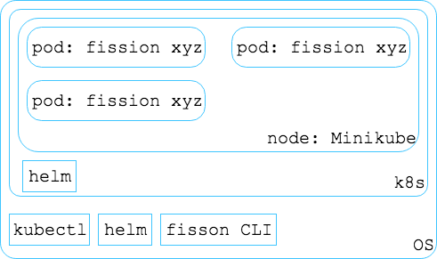

#### Conceptual Model

> 2018-07-29 Fission Concept, made using draw.io

Setup steps can be found in the [Installation Guide](https://docs.fission.io/0.9.1/installation/installation/). The main elements of the installation are:

0. **minikube** - simulator of your would-be cluster that is a number of Virtual Machines or Servers. It uses single Node. The open Go language code base in [GitHub](https://github.com/kubernetes/minikube) has more than 230 contributors. Installation command can be found on the [release page](https://github.com/kubernetes/minikube/releases) of the GitHub repository.
0. **kubectl** - CLI for k8s (_an application that I am still learning_). [Official k8s documentation](https://kubernetes.io/docs/tasks/tools/install-kubectl/) states exact steps for the installation on your OS.
0. **helm** on _OS_ and _k8s_ - package manager for k8s. It is able to install _k8s services_, like fission with minimal number of commands.
0. **fission CLI** on OS - tool to control deployment and testing on the POC, learning phase.
0. **fission** using help in k8s - _k8s service_.

#### Acronyms

- CLI - Command Line Tool
- POC - Proof of Concept
- k8s service - abstract concept that includes a number of pods and k8s processes