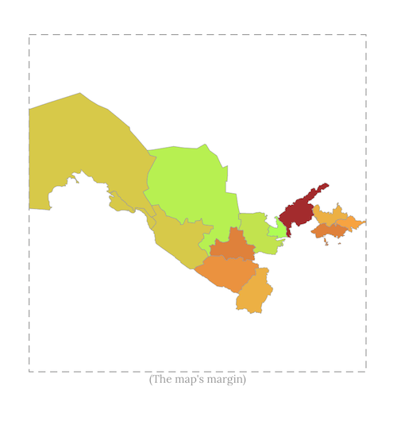
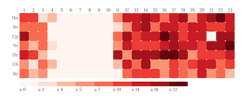
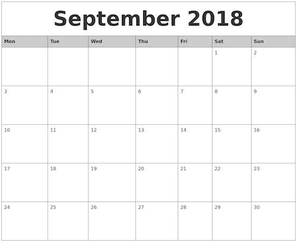

#### Software Engineering

Played around with deterministic anonymization to comply with GDPR.  
Dug into geo json with the goal of creating visalization of Uzbekistan map.  
Invested Saturday evening and made it work.  
It was a requirement to learn d3 basics on the way.  

> Uzbekistan Map Visualization

It is still raw to be included to [UzAnalytics](www.uzbekistananalytics.com)    
I made heatmap based on real data though.   

> Publising Time Heatmap  

What I did not do yet is to verify Telegram API dates with real time of the blogger.  
The visualization already makes sense.  
Friday evening is the slot most posts were written at.

#### Personal Growth

Self-monitoring has been a challenge for me.  
What keeps me motivated is the monthly.

> Monthly Visualization Sheet (A4)  

Seems to be working.  
I already see at which day I did what with a glance.  
I track exercises.  
I track sleep.  
Next step is to create visualizations based on the data.  
Also want to track weight.

#### Body

Ran for 15 mins twice this week.  
Still, monitoring how that affects my brain work.

#### Books

##### Christensen, C., Allworth, J., Dillon, K., (2012). _How Will You Measure Your Life?_ London: HarperCollinsPublishers.

The book suggested by a colleague.  
The authors focus on the idea that you can be exceptionally good at work, but work is not the only part of our life.  
The focus is on Harvard Business School graduates, at least at the beginning of chapters.

##### Strelecky, J., (2007). _The Big Five for Life: A story of One Map and Leadership's Greatest Secret_ London: piactus.

I just struck me this week.  
That is the phrase that my colleague used to say: "one is not born to work".  
After a vacation and a week after it, I realized that memories are vivid in memory.  
So travelling and non-routine experiences make our life richer.  
Mr Strelecky stresses that many people have on their bucket list the point to travel the world.  
He brings similar point to the title of the book.  
On safari people have a list of 5 animals that people expect to see.  
They measure the success of the safari if they manage to observe them.  
The five for life then, is just a bucket list of key things you want to achieve that drive your throughout your life.  

##### Delvin, K., (2012). _Introduction to Mathematical Thinking_ Petaluma: Keith Delvin

Says that the best mathematicians work for National Security Agency.  
The Economist in the article of quantim computers and cryptography also point to that.  
That is fascinating, at least for me.