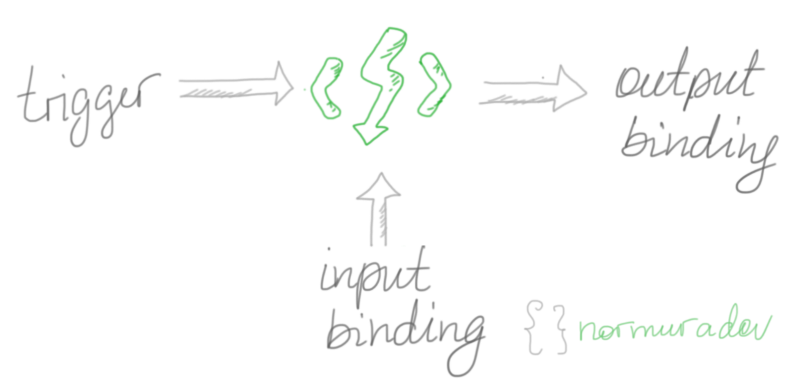
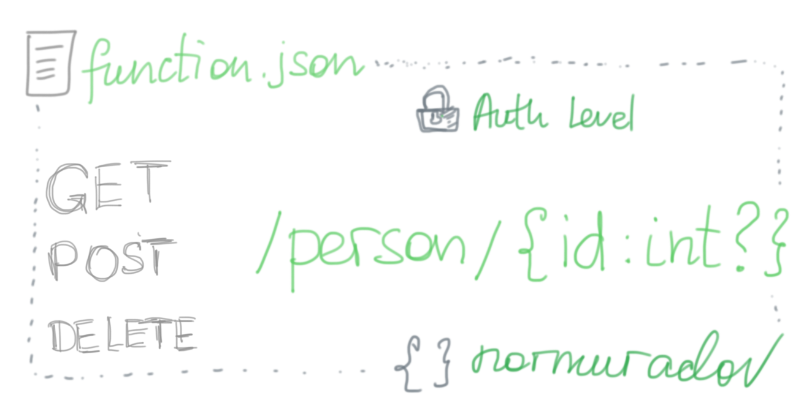

### Azure Functions: Part I

Azure Functions is a Service by Azure that comes as a modern approach to solve eternal problems in software. As the first solution we build an API.

Follow this to bootstrap yourself:  
    - Sign up to Azure and create basic subscription or try for free.  
    - Install:  
        - Visual Studio Code  
        - Azure Functions Core Tools  
        - NodeJS  
        - Azure, Visual Studio Code Extension:  

Components that allow integration with Azure are triggers and out-/in-put bindingds.

The basic configuration for HTTP triggered function could also be [RESTful](https://www.ics.uci.edu/~fielding/pubs/dissertation/fielding_dissertation.pdf).

The code is [here](https://github.com/pharrukh/intro-to-az-func).

Below you can find the overview:
