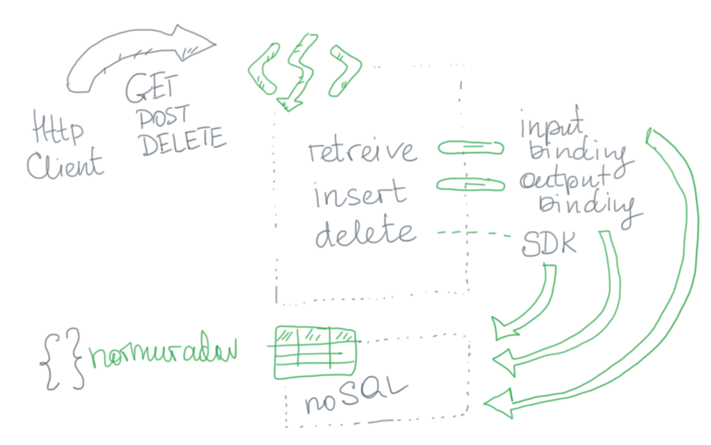

### Azure Functions: Part II: Bindings

Now I would like to look at bindings.

The plan is to use table storage as a persistance layer.   
I used mixed approach of bindings and SDKs:

The code is [here](https://github.com/pharrukh/intro-to-az-func/tree/e2c7e3417204023fa749dfddcdf61333c3257703).

