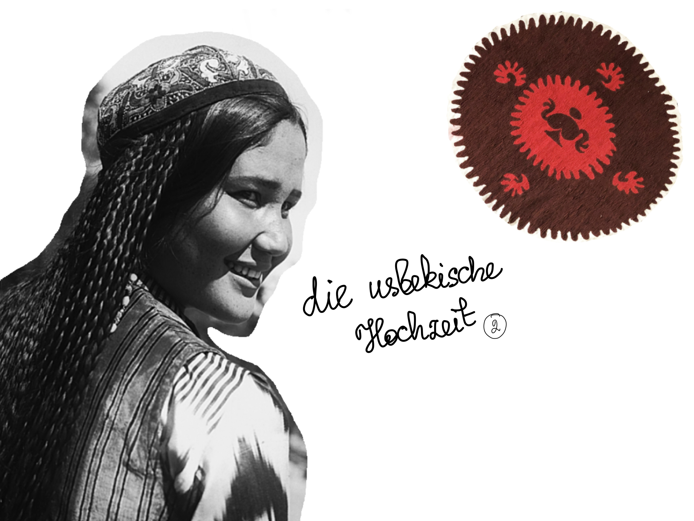
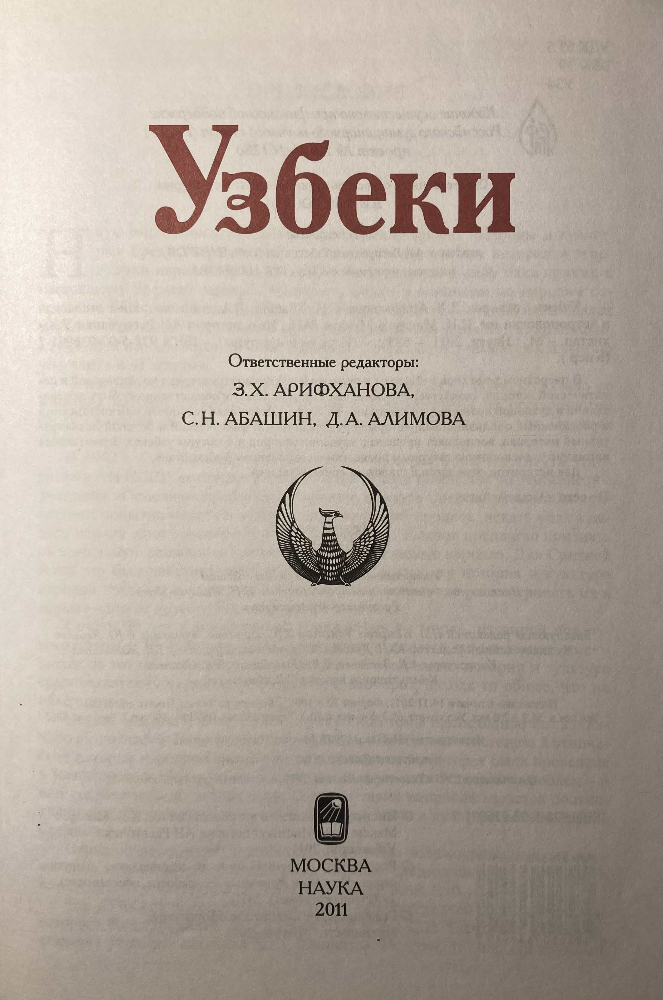

# Eine usbekische Hochzeit

Diese Woche habe ich das Kapitel über die Hochzeit aus dem Buch "Die Usbeken" von Arifchanova et al. (Moskau, 2011) gelesen. 

Bevor eine Familie gegründet wird, werden fünf Schritte gemacht: Besuch der Ehestifter (sowtschi), Übereinkunft (kelischuv), Verlobung (Foticha), Hochzeit (katta tuj) und Besuch der Braut ihres Elternhauses (tschallar).

Zuerst besuchen Ehestifter (sowtschi) des Jungen die Familie von der jungen Frau. Beide Familien loben die Tugenden der jungen Frau und des jungen Mannes. 

Dann wird eine Tischdecke (dastarchan) mit Brot, Süßigkeiten und anderen Gerichten drinnen von den Ehestiftern des Bräutigames zur Familie der Brautes gebracht. 

Die Familie der jungen Frau kann eine Antwort geben, ohne die direkt zu sagen. Wenn die Familie der Braut absagt, wird die Tischdecke wie gebracht zurückgegeben. Wenn die Familie von der jungen Frau zasagt, tauscht die die Süßigkeiten mit den neuen Süßigkeiten in der Tischedecke.

Wenn die Geschenke von der Familie des jungen Mannes akzeptiert werden, beginnt die zweite Familiengrüngungsphase - die Übereinkunft (kelischuv). Jetzt wird der Brautpreis verhandelt.

Wenn eine Einigung erzielt wird, beginnt die Verlobung. Auf dieser Etappe treffen sich die beiden Familien und brechen das Brot (non sindirisch). Es muss zwei dünnen runden Brote sein. Das Brechen symbolisiert buchstäblich die Einigung beider Seiten. Nach diesem Tag sind junger Mann und junge Frau ein Brautpaar (kelin va kujov) und in der Nacht wird die Braut von dem Bräutigam besucht.

Die nächste Etappe ist das Gebetlesen, das "Nikoch" heißt. Danach findet ein grosses Fest statt. Die Braut sagt die folgenden Wörter zu ihrem Vater: "Danke für das Brot und Salz".

Am nächsten Tag macht die Braut im Kreise der neuen Familie die Begrüßung (kelin salom). Die ersten vierzig Tage (tschilla) kocht die Braut kein Gericht.

Die fünfte und letzte Etappe ist die Einladung und ein Besuch des Elternhauses der Braut.